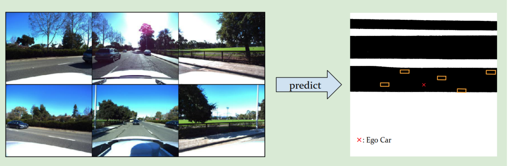
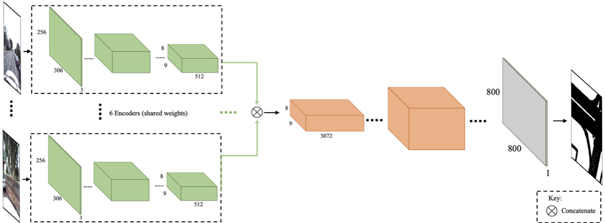

# Autonomous-Driving-Self-Supervised
This is the final project for the [Deep Learning](https://atcold.github.io/pytorch-Deep-Learning/) course at NYU Courant taught by Yann LeCun and Alfredo Canziani. 

## Project Goal

The goal of the project is to train a model using images captured by six different cameras attached to the same car to generate a top down view of the surrounding area. The performance of the model is evaluated by (1) the ability of detecting objects (like car, trucks, bicycles, etc.) and (2) the ability to draw the road map layout.

  

 
## Data
Two datasets are provided:

1. Unlabelled dataset -- just images
2. Labelled dataset -- images and labels (bounding boxes and road map layout)

Since the unlabelled dataset forms ~75% of the entire dataset, it is pivotal to effectively leverage the unlabelled dataset for pretraining. Specifically, in this project, we use self-supervised learning to pretrain the models.

### Dataset Organization
The dataset is organized into three levels: scene, sample and image:
1. A scene is 25 seconds of a car’s journey.
2. A sample is a snapshot of a scene at a given timeframe. Each scene is divided into 126 samples, so about 0.2 seconds between consecutive samples.
3. Each sample contains 6 images captured by cameras facing different orientations. Each camera captures 70 degrees view. For simplicity, we assume that the angle between the cameras is 60 degrees.

For the labelled dataset, two kinds of labels are provided:
1. The bounding boxes of surrounding objects.
2. The binary road image.

Note that the input to the model is 6 images captured from 6 different cameras positioned around the car whereas the output is a top-down view for the *entire scene*. The top-down view can be obtained by combining the binary road image with the bounding boxes of surrounding objects as shown below:

  

## Evaluation
There are 2 evaluation metrics used; one for binary road map segmentation and one for object detection:
1. For road map segementation, we use the average threat score, which is defined as:

$$TS = \frac{TP}{TP+FP+FN}$$ 

2. For object detection, we use average mean threat score at different intersection over union (IoU) thresholds. There are five different thresholds (0.5, 0.6, 0.7, 0.8, 0.9). For each threshold,
we calculate the threat score. The final score is a weighted average of all the threat scores:

$$Object\ Detection\ Score = \sum_{t}\frac{1}{t}\frac{TP(t)}{TP(t)+FP(t)+FN(t)}$$

## Results
We achieved threat scores of 0.762 and
0.0143 on the validation set on the road segmentation and object detection tasks respectively. Furthermore, we ranked $8^{th}$ overall on the leaderboard.

## Road Segmentation

The figure below shows the road segmentation pipeline:

  

For designing decoder architectures, we experimented with
2 strategies. Firstly, we used up-sampling and 2D convolutions to increase the spatial representations whereas,
secondly, we used transposed convolutions. We observed
that the latter yielded better results as shown below:

| Upsampling + Convolutions      | Transposed Convolutions |
| :---        |    ----:   |
| 0.733      | 0.741       |

### Self-supervised Pretext Tasks

Next, we utilized self-supervised pretext tasks in order to
pretrain the network on the unlabeled dataset. Here, we
used 2 pretext tasks: jigsaw and our own designed pretext
task which we call **stereo**. Similar to the jigsaw idea, the
task is the following: given a randomly permuted sequence
of images from the 6 cameras, the network has to predict the
permutation. The intuition behind designing this task was
that in order to accurately perform road segmentation for
the entire scene, the network needs to know which camera
represents which part of the scene. However, the stereo
pretrain network could simply cheat by looking at the body
of the ego-car that is visible in each image. Since this
view of the ego-car is fixed across different frames, the
network would not learn anything about the scene itself.
In order to avoid this, we crop each of the 6 images to
the central 150×150 region, thereby removing any view of
the ego-car from the images. In comparison to the jigsaw
pretext task, pretraining with the stereo pretext task yielded
better results when both methods were pretrained for 700
permutations. However, increasing the jigsaw permutations
to 1000 yielded better results.

*Note: Stereo has maximum permutations = 6! = 720.*

| No Pretrain      | Jigsaw $(700)^{*}$ | Stereo $(700)^{*}$ | Jigsaw $(1000)^{*}$ |
| :---        |    :----:   | :----: | ----: |
| 0.741      | 0.750       | 0.753 | 0.762 |

 \* represents number of permutations

 ### Visualizations

In order to verify our hypothesis that the stereo pretrain
task does indeed help the network learn the different camera
views, we did a T-SNE visualization of the encoded features
from the stereo pretrain network. The figure below shows that the
network clusters the feature representations for the 6 camera images in different regions of the latent space, thereby helping the network perform the road segmentation task since
it can distinguish between the different camera views and
match each camera view to a particular region of the scene
road segmentation result.

  

## Object Detection

For the object detection task, two types of architectures were tested:
1. YOLOv3
2. Faster R-CNN

Faster-RCNN yielded the best results. For detailed results and analysis, please refer to the [report](report.pdf) and the [slides](slides.pdf). Here's a 3-minute overview of the project:

<video width="320" height="240" controls>
  <source src="demo.mp4" type="video/mp4">
</video>

## Acknowledgments

Inspiration was taken from the following repositories while developing this project:
 
[Faster RCNN (a)](http://pytorch.org/tutorials/intermediate/torchvision_tutorial.html) | [Faster RCNN (b)](https://github.com/pytorch/vision/tree/master/references/detection) | 
[YOLO v3](https://github.com/eriklindernoren/PyTorch-YOLOv3) | 
[Jigsaw Pretext Task](https://github.com/bbrattoli/JigsawPuzzlePytorch) | 
[FCN](https://github.com/wkentaro/pytorch-fcn)
 
 
